# 🧠 Duo Semantle

A serverless daily word-guessing game inspired by [Semantle](https://semantle.com/), with a twist: instead of finding one hidden word, players must discover **two semantically distinct target words**.

Each guess is evaluated against both targets using **cosine similarity between pretrained fastText word embeddings**. The game provides independent similarity scores for both targets and maintains the player's session history.

The entire application is deployed using **AWS serverless services** and provisioned as infrastructure-as-code using **AWS CDK with TypeScript**.

---

## 🎮 How the Game Works

Each day:

1. Two target words are automatically selected.
2. The targets are chosen to be semantically dissimilar.
3. Previously used targets from the last **30 days** are excluded.
4. A ranking of the **top 1,000 closest words** is precomputed for each target.
5. Players submit guesses through the web interface.
6. Each guess is validated against the English vocabulary.
7. Valid guesses are scored against both hidden targets.
8. Guess history is persisted for the current session.
9. The game is complete once both target words are discovered.

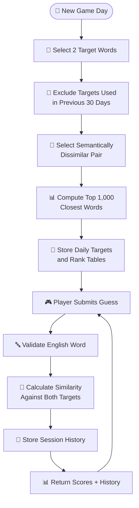

---

# ✨ Features

| Feature                    | Description                                                             |
| -------------------------- | ----------------------------------------------------------------------- |
| 🎯 Dual Targets            | Each daily puzzle contains two hidden target words                      |
| 🧠 Semantic Similarity     | Guesses are scored using fastText word embeddings and cosine similarity |
| 🔤 Word Validation         | Guesses are checked against a curated English vocabulary                |
| 📊 Dual Scoring            | Every valid guess receives an independent score against both targets    |
| 📈 Rank Tables             | Top 1,000 semantically closest words are precomputed for each target    |
| 🔄 Daily Target Rotation   | New targets are automatically generated every day                       |
| 🚫 Repeat Prevention       | Targets used during the previous 30 days are excluded                   |
| 💾 Session History         | Guess history and scores are persisted per session                      |
| ⚡ Serverless Backend       | Independent AWS Lambda functions handle game operations                 |
| ☁️ Serverless Hosting      | Frontend is hosted using Amazon S3 and CloudFront                       |
| 🏗️ Infrastructure as Code | AWS infrastructure is defined and deployed using AWS CDK                |

The current implementation separates word validation, scoring, target generation, guess handling, and frontend hosting into independent infrastructure components.

---

# 🛠️ Technology Stack

## Application

| Technology          | Version / Details               | Purpose                                    |
| ------------------- | ------------------------------- | ------------------------------------------ |
| **Python**          | `3.12`                          | AWS Lambda runtime                         |
| **NumPy**           | AWS SDK for Pandas Lambda Layer | Vector operations and cosine similarity    |
| **fastText**        | `cc.en.300.bin`                 | Pretrained 300-dimensional word embeddings |
| **TypeScript**      | `~7.0.2`                        | AWS infrastructure code                    |
| **AWS CDK**         | `2.1136.0` CLI                  | Infrastructure deployment                  |
| **AWS CDK Library** | `^2.265.0`                      | Infrastructure definitions                 |
| **Constructs**      | `^10.5.0`                       | CDK construct framework                    |

The Lambda functions use Python 3.12, while the infrastructure is defined in TypeScript using AWS CDK.

---

# ☁️ AWS Services

| AWS Service                     | Usage                                                                                |
| ------------------------------- | ------------------------------------------------------------------------------------ |
| **AWS Lambda**                  | Serverless execution for validation, scoring, target selection, and guess processing |
| **Amazon API Gateway HTTP API** | Exposes Lambda-backed HTTP endpoints                                                 |
| **Amazon S3**                   | Stores vocabulary files, embedding partitions, and frontend assets                   |
| **Amazon DynamoDB**             | Stores daily targets and player/session guess history                                |
| **Amazon EventBridge**          | Triggers daily target generation                                                     |
| **AWS Lambda Layers**           | Shares common game logic and provides NumPy/Pandas dependencies                      |
| **Amazon CloudFront**           | CDN and HTTPS delivery for the frontend                                              |
| **AWS CDK**                     | Infrastructure as code and deployment                                                |
| **S3 Origin Access Control**    | Secures CloudFront access to the private frontend bucket                             |

These services are explicitly provisioned by the CDK stack. The S3 buckets are private, DynamoDB tables use on-demand billing, and CloudFront accesses the frontend bucket through Origin Access Control.

---

# 🏗️ Architecture

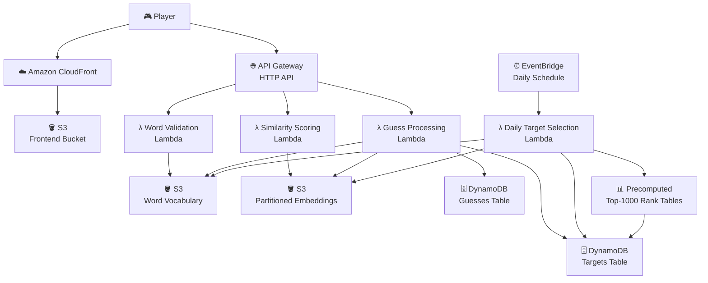

The infrastructure is split into independent Lambda-backed API routes and scheduled processing, rather than using a monolithic backend.

---

# 🔌 API Architecture

The application uses a single **API Gateway HTTP API** with separate routes backed by independent Lambda functions.

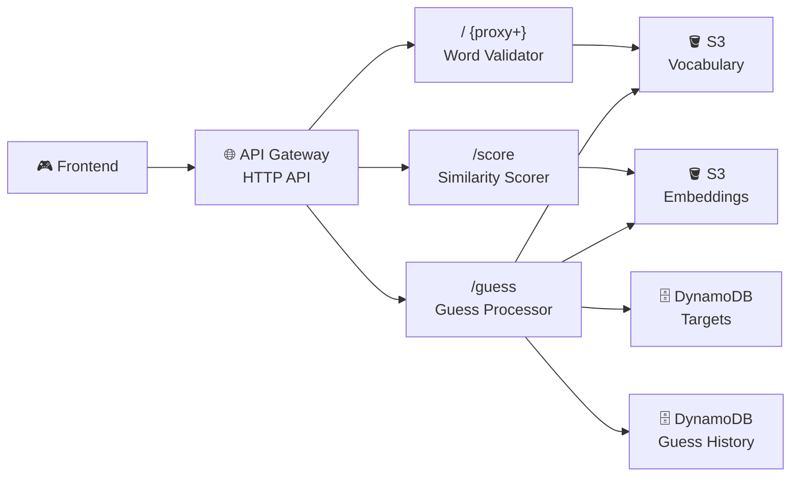

The CDK stack creates the HTTP API and connects the individual routes to their corresponding Lambda integrations.

---

# 🔤 Word Validation Flow

The word validation service determines whether a submitted guess exists in the application's validated English vocabulary.

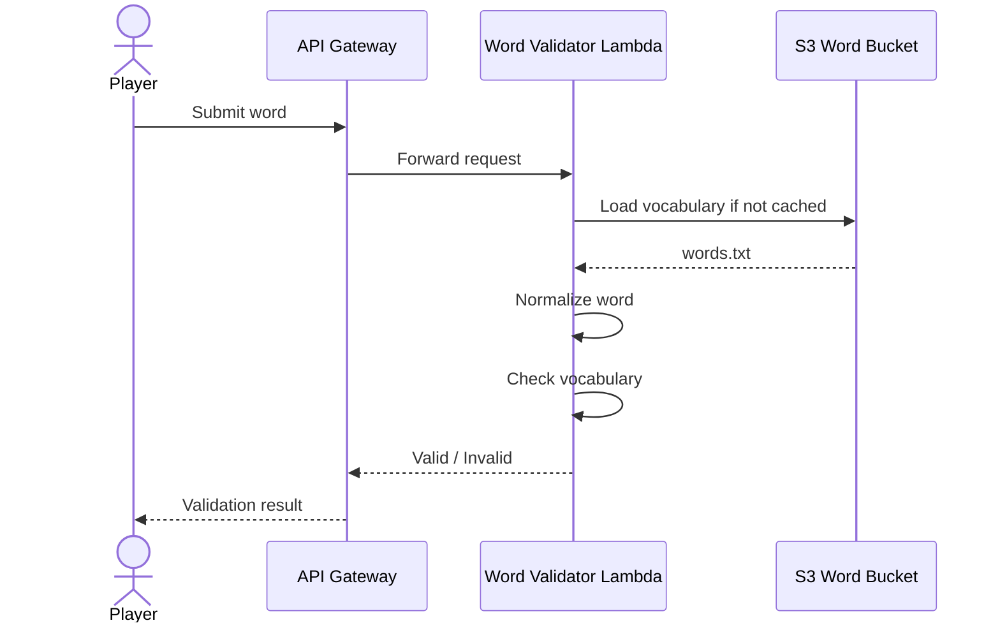

The vocabulary is downloaded from S3 into Lambda's temporary storage and cached for subsequent invocations within the execution environment.

---

# 🧠 Similarity Scoring

Similarity is calculated using the cosine similarity between the embedding vectors of two words.

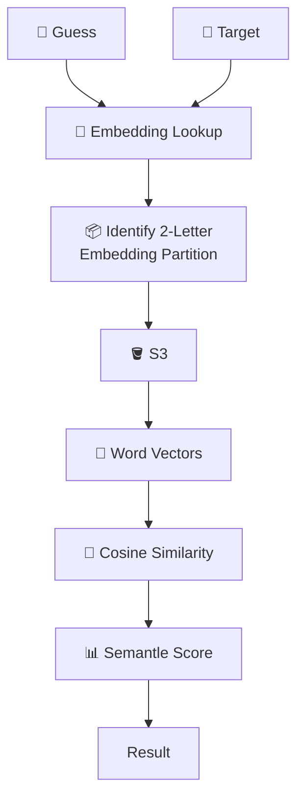

The embedding files are partitioned by the first two letters of a word. This allows a Lambda invocation to load only the relevant partition instead of loading the complete embedding dataset.

The similarity calculation is:

```text
cosine_similarity(A, B)
    = (A · B) / (||A|| × ||B||)
```

The resulting similarity is bounded to `[-1, 1]` and converted into the game's score representation.

---

# 🎯 Daily Target Generation

Target selection runs automatically once per day using an **Amazon EventBridge scheduled rule**.

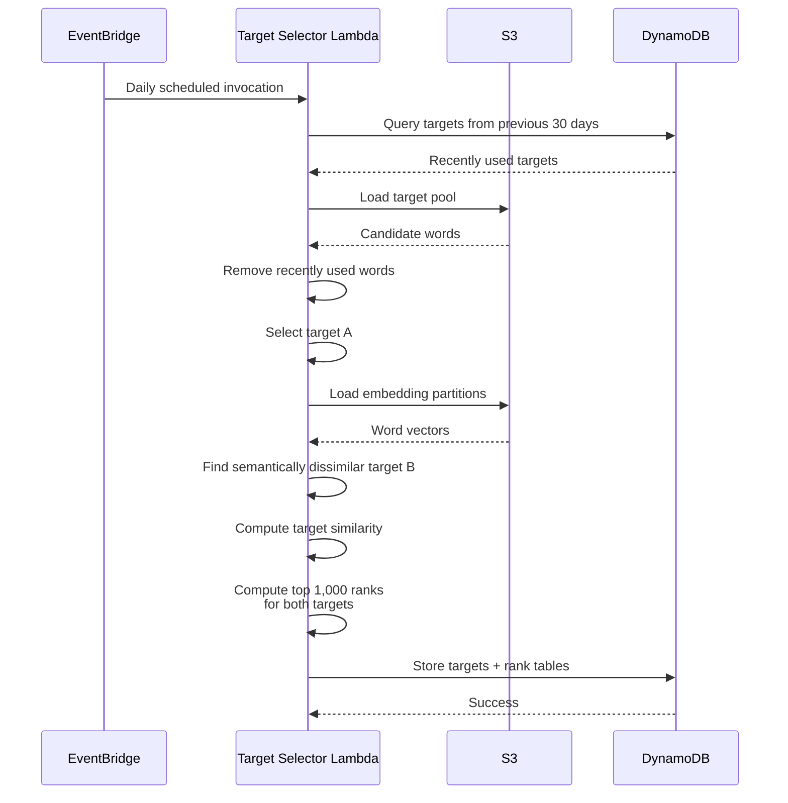

The target selector currently uses a **30-day repeat window**, samples candidate words, and seeks a second word below a semantic similarity threshold of `0.15`; if none qualifies in the sample, it falls back to the least-similar candidate.

---

# 📊 Rank Precomputation

Rather than calculating the complete vocabulary ranking for every player guess, rankings are generated once when the daily targets are selected.

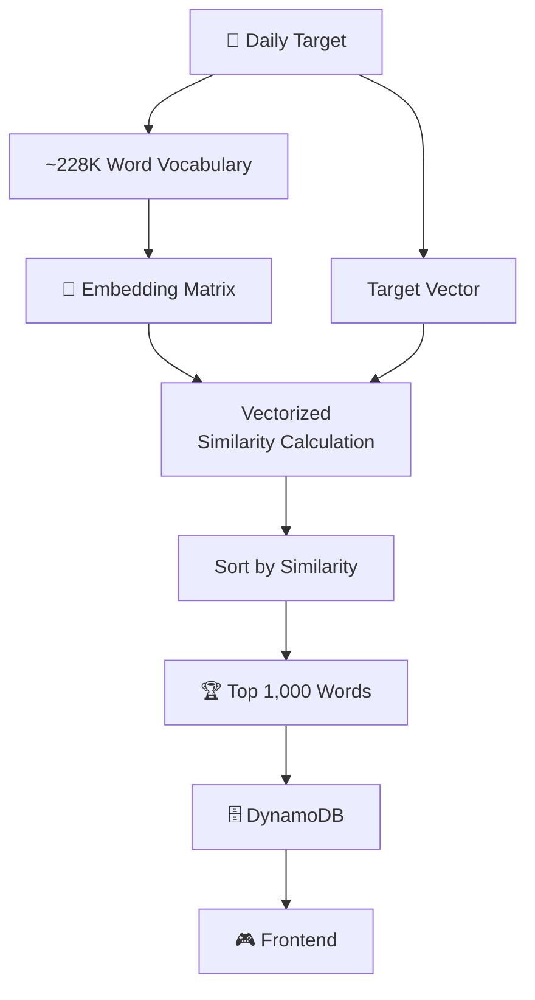

The implementation loads the complete partitioned vocabulary for this batch computation, performs vectorized similarity calculations, sorts the results, and stores the top 1,000 words for each target.

This allows the frontend to use precomputed ranking data rather than triggering a server-side vocabulary search for every guess.

---

# 🎮 Guess Processing Flow

A normal player guess passes through a single Lambda that coordinates validation, target lookup, embedding retrieval, scoring, and session persistence.

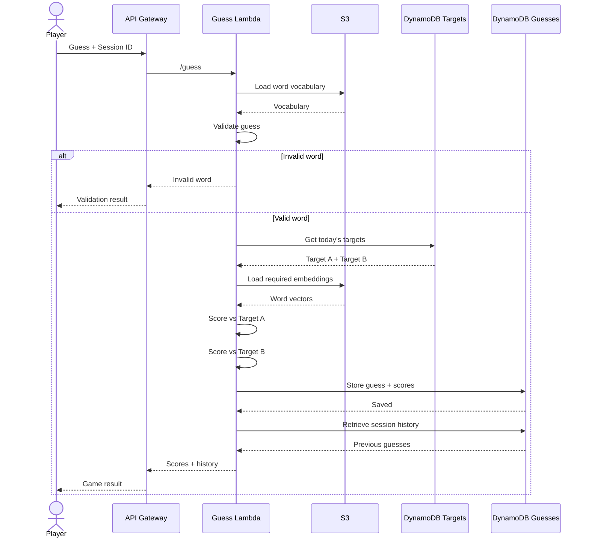

The guess Lambda persists each guess using `session_id` and `timestamp` as the DynamoDB keys and returns the session's score history ordered by the highest score between the two targets.

---

# 🗄️ Data Storage

The application uses separate S3 buckets and DynamoDB tables for different data responsibilities.

## Amazon S3

| Bucket            | Contents                         | Access                             |
| ----------------- | -------------------------------- | ---------------------------------- |
| Words Bucket      | `words.txt` and target pool      | Private                            |
| Embeddings Bucket | Partitioned word embedding files | Private                            |
| Frontend Bucket   | Static frontend assets           | Private; served through CloudFront |

The CDK stack explicitly blocks public access on these buckets.

## DynamoDB

| Table                  | Partition Key | Sort Key    | Purpose                                     |
| ---------------------- | ------------- | ----------- | ------------------------------------------- |
| `duo-semantle-targets` | `pk`          | `date`      | Daily target words and precomputed rankings |
| `duo-semantle-guesses` | `session_id`  | `timestamp` | Player guess and score history              |

Both tables use **PAY_PER_REQUEST** billing.

---

# ⚡ Lambda Functions

| Lambda            | Runtime     |  Memory | Timeout | Responsibility                         |
| ----------------- | ----------- | ------: | ------: | -------------------------------------- |
| Word Validator    | Python 3.12 |  256 MB |  10 sec | Validate words against vocabulary      |
| Similarity Scorer | Python 3.12 |  512 MB |  15 sec | Calculate embedding similarity         |
| Target Selector   | Python 3.12 | 3008 MB | 300 sec | Generate daily targets and rank tables |
| Guess Processor   | Python 3.12 |  512 MB |  15 sec | Validate, score, and persist guesses   |

The target selector receives significantly more memory and execution time because it performs the expensive vocabulary-wide ranking computation.

---

# 📦 Lambda Layers

The project uses Lambda Layers to avoid duplicating dependencies and shared logic across functions.

### AWS SDK Pandas Layer

The scoring and target-selection functions use an AWS-provided Pandas/NumPy Lambda layer:

```text
ARN:
arn:aws:lambda:ap-south-1:
336392948345:layer:
AWSSDKPandas-Python312:31
```

### Shared Application Layer

A custom Lambda Layer contains shared:

* Word validation logic
* Similarity/scoring logic
* Embedding lookup logic

This layer is shared by the guess-processing Lambda rather than duplicating the same implementation across functions.

---

# 🧠 Embedding Pipeline

The project uses Facebook's pretrained **fastText English vectors** (`cc.en.300.bin`).

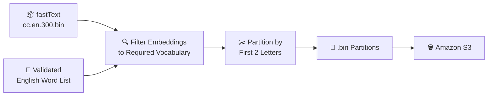

Instead of shipping the original **2.6 GB** fastText model to Lambda, the project precomputes word-specific vectors for the validated vocabulary and stores approximately **240 MB** of partitioned embedding data.

This reduces the amount of data that individual Lambda invocations need to load.

---

# 📚 Data Sources

| Dataset                                        | Usage                                         |
| ---------------------------------------------- | --------------------------------------------- |
| **ESDB / SCOWL Word List**                     | Base English vocabulary                       |
| **Facebook fastText `cc.en.300.bin`**          | Word embeddings                               |
| **Peter Norvig's Google Trillion Word Corpus** | Word-frequency filtering for target selection |

The vocabulary is filtered to remove proper nouns, abbreviations, multi-word expressions, and non-ASCII entries. The target pool is further restricted using word-frequency data and stop-word filtering.

---

# 🏗️ Infrastructure as Code

The entire AWS infrastructure is defined using **AWS CDK with TypeScript**.

```text
infra/
│
├── bin/
│   └── ...
│
├── lib/
│   └── duo-semantle-infra-stack.ts
│
├── package.json
├── tsconfig.json
└── ...
```

The CDK stack provisions:

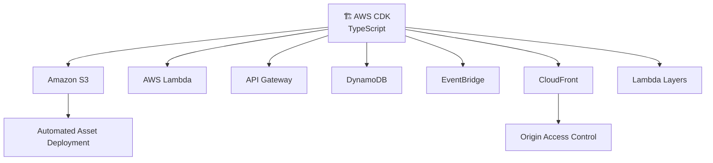

The infrastructure package currently uses AWS CDK CLI `2.1136.0`, `aws-cdk-lib ^2.265.0`, Constructs `^10.5.0`, and TypeScript `~7.0.2`.

---

# 📁 Repository Structure

```text
Duo-Semantle/
│
├── app/
│   └── Local prototyping
│       ├── Word validation
│       ├── Word-list processing
│       ├── Embedding generation
│       ├── Similarity calculations
│       └── Game orchestration
│
├── infra/
│   │
│   ├── lambda/
│   │   └── Word validation Lambda
│   │
│   ├── scoring-lambda/
│   │   └── Similarity scoring Lambda
│   │
│   ├── target-selector-lambda/
│   │   └── Daily target generation
│   │
│   ├── guess-lambda/
│   │   └── Guess processing + history
│   │
│   ├── shared-layer/
│   │   └── Shared validation/scoring/embedding logic
│   │
│   ├── data/
│   │   └── Vocabulary + target pool
│   │
│   ├── data-embeddings/
│   │   └── Partitioned embedding files
│   │
│   ├── frontend/
│   │   └── Static game frontend
│   │
│   ├── lib/
│   │   └── duo-semantle-infra-stack.ts
│   │
│   └── package.json
│
└── README.md
```

The repository intentionally separates **local experimentation/data preparation** from the **AWS deployment infrastructure**.

---

# 🚀 Deployment

## Prerequisites

You need:

| Requirement | Purpose                             |
| ----------- | ----------------------------------- |
| AWS Account | Deploy AWS resources                |
| AWS CLI     | AWS account/configuration access    |
| Node.js     | CDK tooling                         |
| npm         | Install infrastructure dependencies |
| AWS CDK     | Infrastructure deployment           |
| Python 3.12 | Lambda/runtime compatibility        |

---

## Install Infrastructure Dependencies

```bash
cd infra
npm install
```

## Deploy

```bash
npx cdk deploy
```

The CDK deployment provisions the required AWS resources and outputs the API and frontend endpoints.

---

# 🧪 Local Development

The `app/` directory contains the local prototyping and data-processing components used to:

* Build and validate the English word list
* Generate word embeddings
* Partition embedding data
* Test semantic similarity
* Prototype game orchestration

The AWS-specific implementation lives under `infra/`.

---

# ⚙️ Key Design Decisions

### 1. Serverless, Single-Purpose Functions

Instead of implementing one large backend service, the application separates functionality into independent Lambda functions.

```text
                    ┌──────────────────┐
                    │   API Gateway    │
                    └────────┬─────────┘
                             │
          ┌──────────────────┼──────────────────┐
          │                  │                  │
          ▼                  ▼                  ▼
     Validation           Scoring            Guess
       Lambda              Lambda           Lambda
```

This keeps each operation independently deployable and isolates responsibilities.

### 2. Shared Logic Through Lambda Layers

Common validation, scoring, and embedding lookup functionality is packaged into a shared Lambda Layer instead of duplicating the implementation.

### 3. Precomputed Embeddings

The full fastText model is not shipped into Lambda. Word-specific vectors are precomputed and partitioned into smaller files.

```text
2.6 GB fastText model
        │
        ▼
Precompute required vectors
        │
        ▼
~240 MB total
        │
        ▼
Partition by 2-letter prefix
        │
        ▼
Load only required partitions
```

This reduces the amount of data that needs to be loaded during Lambda execution.

### 4. Precomputed Rankings

The expensive vocabulary-wide similarity calculation happens during daily target generation rather than during every player request.

```text
Daily computation
      │
      ▼
Target → Full Vocabulary
      │
      ▼
Similarity calculations
      │
      ▼
Top 1,000 words
      │
      ▼
DynamoDB
      │
      ▼
Fast client-side lookup
```

This shifts expensive batch computation away from the interactive gameplay path.

---

# 📈 Game Data Flow

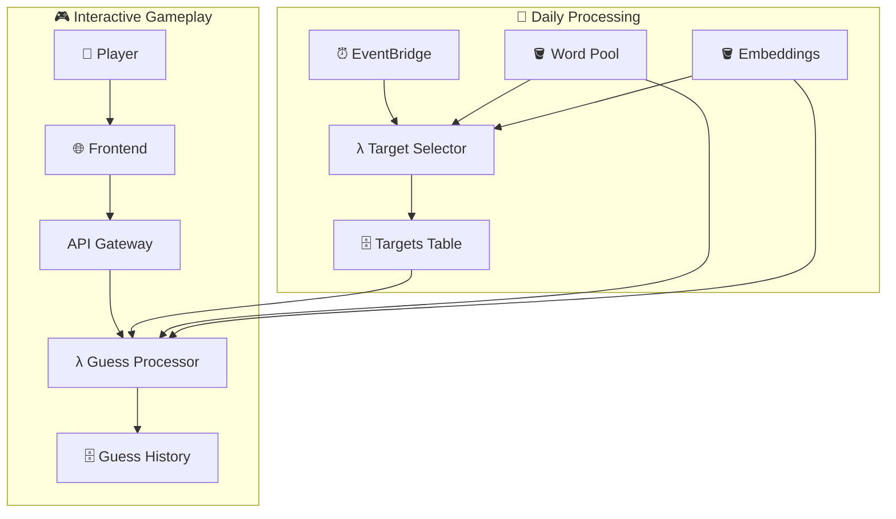

The daily batch workflow prepares the data needed by the interactive gameplay path, keeping per-guess processing focused on validation, embedding lookup, scoring, and persistence.

---

# 📄 License

This project is intended for educational and experimental use.
